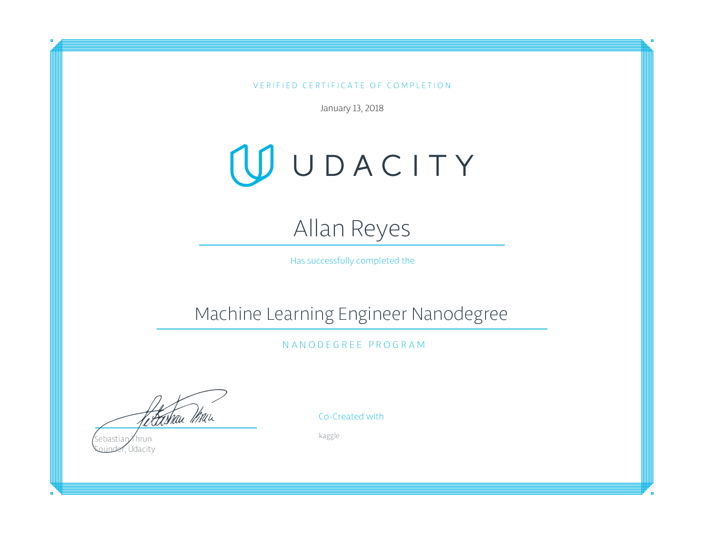

Machine Learning Engineer Nanodegree
====================================

### About

This repository contains submodules for project work associated with Udacity's [Machine Learning Engineer Nanodegree](https://www.udacity.com/course/nd009).

### Projects

- **p0** - Titanic Survival Exploration
- **p1** - Predicting Boston Housing Pricing (Model Evaluation and Validation)
- **p2** - Student Intervention System (Supervised Learning)
- **p3** - Creating Customer Segments (Unsupervised Learning)
- **p4** - Training a Smartcab to Drive (Reinforcement Learning)
- **p5** - Training a Lunar Lander with Deep Q Networks (Capstone Project)

### Related Nanodegree Programs

- [Data Analyst Nanodegree](https://github.com/allanbreyes/udacity-data-science)
- [Deep Learning Nanodegree Foundation](https://github.com/allanbreyes/udacity-deep-learning-foundation)
- [Front-end Web Developer Nanodegree](https://github.com/allanbreyes/udacity-front-end)
- [Full Stack Web Developer Nanodegree](https://github.com/allanbreyes/udacity-full-stack)
