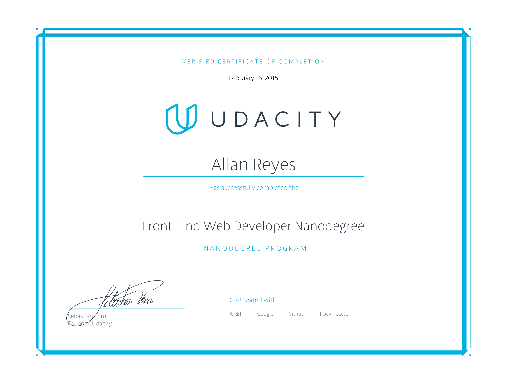

# Front-End Web Developer Nanodegree

### About
This repository contains project work for Udacity's [Front-End Web Developer Nanodegree](https://www.udacity.com/course/nd001) from the November 2014 cohort.

### Projects:
- **p1** - Mockup to Website
- **p2** - Interactive Resume
- **p3** - Classic Arcade Game Clone
- **p4** - Website Optimization
- **p5** - Neighborhood Map Project
- **p6** - Feed Reader Testing

### Courses:
- Intro to HTML and CSS
- Version Control with Git and GitHub
- JavaScript Basics
- Intro to jQuery
- Object-Oriented JavaScript
- HTML5 Canvas
- Website Performance Optimization
- Intro to AJAX
- JavaScript Design Patterns

### Related Nanodegree Programs

- [Data Analyst Nanodegree](https://github.com/allanbreyes/udacity-data-science)
- [Deep Learning Nanodegree Foundation](https://github.com/allanbreyes/udacity-deep-learning-foundation)
- [Full Stack Web Developer Nanodegree](https://github.com/allanbreyes/udacity-full-stack)
- [Machine Learning Engineer Nanodegree](https://github.com/allanbreyes/udacity-machine-learning)
