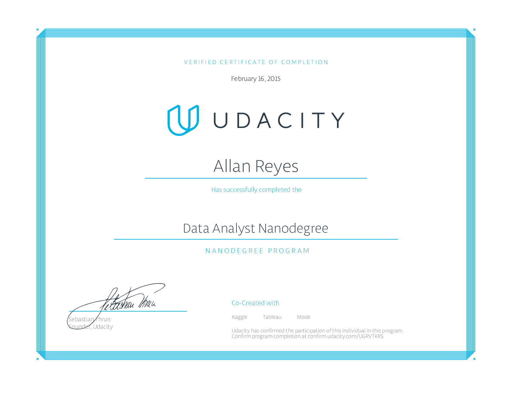

Data Analyst Nanodegree
=======================

### About

This repository contains project work for Udacity's [Data Analyst Nanodegree](https://www.udacity.com/course/nd002) from the November 2014 cohort.

### Projects

- **p1** - Analyzing the NYC Subway Dataset
- **p2** - Data Wrangle OpenStreetMaps Data
- **p3** - Explore and Summarize Data
- **p4** - Identifying Fraud from Enron Email
- **p5** - Make Effective Data Visualization

### Courses

- Intro to Data Science
- Data Wrangling with MongoDB
- Data Analysis with R
- Intro to Machine Learning
- Data Visualization and D3.js

### Related Nanodegree Programs

- [Deep Learning Nanodegree Foundation](https://github.com/allanbreyes/udacity-deep-learning-foundation)
- [Front-end Web Developer Nanodegree](https://github.com/allanbreyes/udacity-front-end)
- [Full Stack Web Developer Nanodegree](https://github.com/allanbreyes/udacity-full-stack)
- [Machine Learning Engineer Nanodegree](https://github.com/allanbreyes/udacity-machine-learning)

### Personal Notes

1. Please don't plagiarize any of my projects—it won't help you in the long run!
2. Feel free to reach out to me on Twitter ([@allanbreyes](https://twitter.com/allanbreyes)) or [other methods](https://allan.reyes.sh/#contact).
