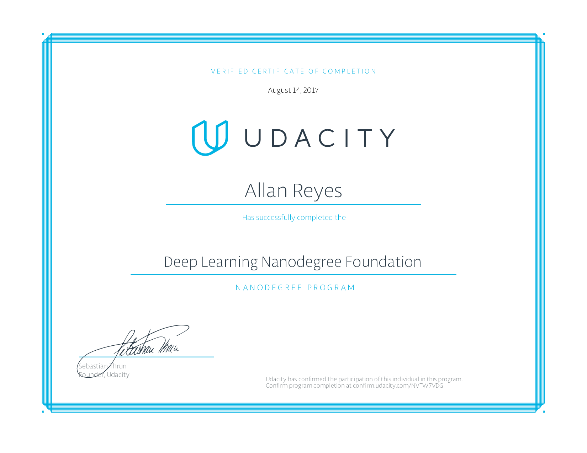

Deep Learning Nanodegree Foundation
===================================

## About

This repository contains project work for Udacity's [Deep Learning Nanodegree
Foundation](https://udacity.com/course/nd101).

## Projects

- **p1** - Neural Network: a simple ANN built from scratch with `numpy` to
  fit bike-sharing data
- **p2** - Image Classification: classifying images from the **CIFAR-10**
  dataset using a convnet
- **p3** - Generate TV Scripts: generating scripts using recurrent neural
  networks
- **p4** - Translate a Language: language translation with recurrent neural
  networks
- **p5** - Generate Faces: using generative adversarial networks to generate
  realistic faces

### Related Nanodegree Programs

- [Data Analyst Nanodegree](https://github.com/allanbreyes/udacity-data-science)
- [Front-end Web Developer Nanodegree](https://github.com/allanbreyes/udacity-front-end)
- [Full Stack Web Developer Nanodegree](https://github.com/allanbreyes/udacity-full-stack)
- [Machine Learning Engineer Nanodegree](https://github.com/allanbreyes/udacity-machine-learning)

### Personal Notes

1. Please don't plagiarize any of my projects—it won't help you in the long run!
2. Feel free to reach out to me on Twitter ([@allanbreyes](https://twitter.com/allanbreyes)) or [other methods](https://allan.reyes.sh/#contact).
