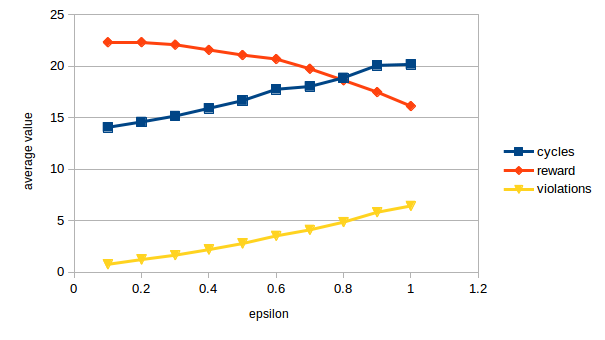
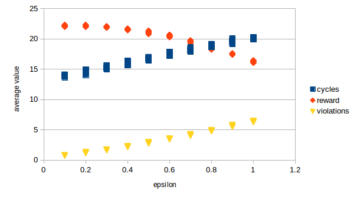

Training a Smartcab How to Drive
================================

## General

This project applies reinforcement learning techniques for a self-driving agent in a simplified world to aid it in effectively reaching its destinations in the allotted time. The agent implements a Q-Learning algorithm for the self-driving agent to guide the agent towards its destination within the allotted time.

## Implementing a Basic Driving Agent

<!-- Observe what you see with the agent's behavior as it takes random actions. Does the smartcab eventually make it to the destination? Are there any other interesting observations to note? -->

With the goal of creating a simple, albeit naive, driving agent, I started by creating a stochastic agent with random walk: it chose randomly from valid actions at each cycle. The core logic was implemented in the `update` definition via:

```python
action = random.choice([None, 'forward', 'left', 'right'])
```

When disabling the deadline via `enforce_deadline=False`, the agent was observed to eventually reach its destination. Qualitatively speaking, it typically reached its destination quicker if the starting position was closer. The agent characteristics are that of random walk agents: there is no intelligence and it disregards any notions of risk or reward. The agent reaches the goal purely by chance.

## Informing the Driving Agent

<!-- What states have you identified that are appropriate for modeling the smartcab and environment? Why do you believe each of these states to be appropriate for this problem? -->

The states I chose map directly to the provided inputs, with the addition of a `next` parameter, denoting the next waypoint location. In all, the state is completely defined by:

| Measure   | Description |
|-----------|-------------|
| light     | Whether the light is green or red |
| next      | The next waypoint location relative to the agents current location and heading |
| oncoming  | The heading of a car on the opposite side of the intersection, if present |
| left      | The heading of a car on the left side of the intersection, if present |
| right     | The heading of a car on the right side of the intersection, if present |

The state completely describes the conditions at the intersection (via `light`, `oncoming`, `left`, `right`) and a heuristic for which action should be taken (via `next`). It's important to note that this state is defined by low-level measures; concretely, it is in-line with the agent's short-term goal of making it to the next end-point, but myopic to the long-term goal of making it to the destination. Nonetheless, the inclusion of attributes describing the intersection afford the agent the opportunity to learn and obey traffic rules.

An egocentric approach is appropriate because of the nature of the problem: the wrapping grid world with no obstacles meant that no higher-order path-planning needed to be conducted. For all intents and purposes, each intersection is equivalent. In that regard, the agent could adopt a seemingly myopic and egocentric view of the world, only "caring" about what happens at the intersection it is currently at, and where the next waypoint resides. There is no need to sense the agent's absolute location, absolute heading, nor relative location to the goal. While this data might have been obtainable via dead-reckoning, I chose not to incorporate it for both simplicity and the notion that scaling to a non-deterministic world would have been impossible without faculties to sense its location or heading. Along similar lines, I specifically chose to exclude `deadline` from the state; the agent shound't try to violate traffic rules just to reach the destination! Additionally, adding a 6th measure with myriad possibilities (0 to ~100) would have exploded the state space, preventing the agent from learning anything.

## Implementing a Q-Learning Driving Agent

<!-- What changes do you notice in the agent's behavior when compared to the basic driving agent when random actions were always taken? Why is this behavior occurring? -->

After implementing a basic Q-Learner in the driving agent architecture, I noticed significant reduction in the time needed to reach the destination. Specifically, the agent had bias towards movement to the next waypoint (as opposed to randomly). After 100 runs of 100 trials, the average running reward was `21.3` and the average number of steps taken was `13.3`. The agent was incredibly quick to learn and develop a robust policy layer; in comparison, in the first run of the first trial (learning from scratch) the agent received less than half the reward (`9.5`) and took more than twice as long to reach the destination (`28` steps). Most importantly, the agent acheived a 100% success rate in reaching its destination.

After the first trial, the agent quickly learned the "rules of the road", particularly for traffic signs. Throughout the remaining trials, less common encounters with other cars on the roads added increased, albeit marginal, knowledge and proficiency to the agent. Comparing the metrics from the first half to the last half across the 100 runs, I observed a `3%` increase in reward and `4%` decrease in steps taken. I believe this to be from learning from less common states, like complex intersection interactions.

Of important note, the agent is blind to both its current location and the deadline. An optimal agent (focused on selfish goals of maximizing its own rewards) would have held a "holding pattern", accruing reward points for correctly obeying traffic rules, and only landing on the destination at the last possible cycle. However, given the inputs and how the agent was built, neither location nor deadline was incorporated into the state. As such, the agent is myopic in its handling of rewards: it maximizes its short-term reward with little regard for delayed, future rewards. Nonetheless, for practical matters, we might consider that a smartcab taking the most direct route to the destination instead of a "joyride" is practically optimal.

## Improving the Q-Learning Driving Agent

<!-- Report the different values for the parameters tuned in your basic implementation of Q-Learning. For which set of parameters does the agent perform best? How well does the final driving agent perform? -->

After tuning, I found the following parameters to be the optimal combination:

| Parameter             | Value   |
|-----------------------|---------|
| alpha (learning rate) | 0.9     |
| epsilon (exploration) | 0.2     |
| gamma (discount)      | 0.0     |
| epsilon decay         | 0.00111 |

The agent was tuned using a manual grid search across two hyper-parameters `alpha` and `epsilon` by conducting 100 runs of 100 trials and comparing the reward and cycle time. Since the agent is myopic and egocentric, `gamma` and the optimal future estimate remained unused (set to `0`). The grid consisted of `100` different configurations, as `alpha` and `epsilon` were permuted from `0.1` to `1.0` with a `0.1` step size. (See `data.csv` for test results.) The proposed combination was chosen because it maximized reward and minimized both cycles and violations. The agent still maintained a `100%` success rate and achieved a marginal increase in reward (average of `22.3`) and a slight increase in time taken (`14.6`).

The agent was most sensitive to changes in `epsilon`. A typical chart at fixed alpha (`0.9`) looked like:



All 10 alpha charts superimposed looked like:



I believe that the agent, with its immediate and "greedy" behavior, converges onto a policy that reaches the destination in minimum possible time, incurring minimal penalties. As alluded to earlier, the myopic state policies ensures that the agent produces knowledge of the optimal step at each intersection. However, the exploration factor (epsilon) does lead the agent to purposefully make incorrect moves. To mitigate this, I implemented a decay factor to decrease epsilon across trials. Nonetheless, the agent still incurs an average violation rate of `0.77` per run. While a minor contribution may be uncommon and complex intersection actions, another source of errors is due to misappropriation of reward. Concretely, at the end of each trial, the agent appropriates an exceedingly large amount of reward to the final step that takes it to the destination; with the myopic view compounded with exploration into violating actions, the agent might prefer to take that same action in a completely different context (far away from the destination).

Taking optimal sub-steps is not necessarily the optimal policy. In an extreme case, if a traffic light were "broken" and stayed red forever, the agent would have stayed at the intersection ad infinitum. A notion of history and memory is needed in the state (e.g. cycles stopped at an intersection) to correctly balance the delayed and long-term rewards. In that same example, the agent could have "escaped" the local minima by making a right turn, or simply passing through the red light (incurring a penalty, but resulting in a long-term reward). This optimal policy is highly-sensitive to the rewards and penalties of collisions, running red lights, and deadlines. Nonetheless, there's still room for improvement!

## Appendix

### Installation

This project requires **Python 2.7** with the [pygame](https://www.pygame.org/wiki/GettingStarted) library installed.

### Running

Run:

```
python smartcab/agent.py
```  
