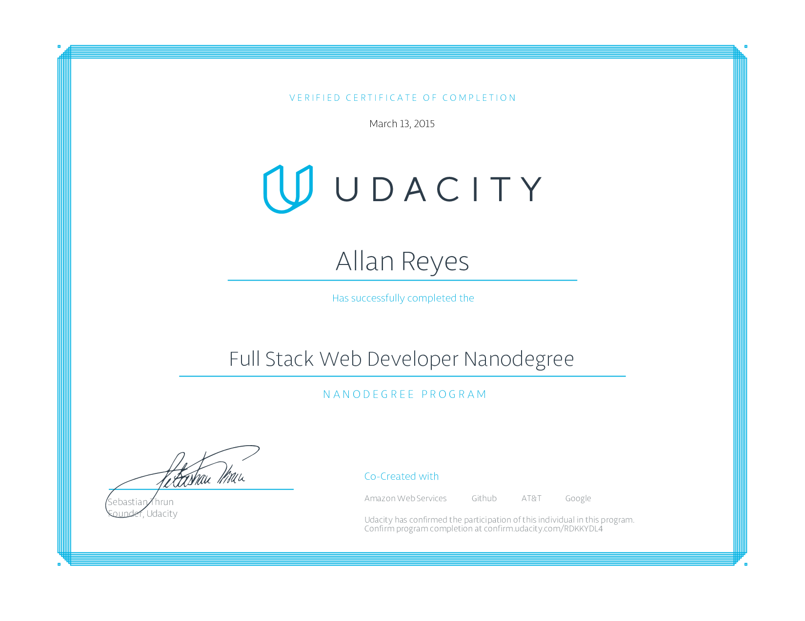

Full Stack Web Developer Nanodegree
===================================

### About

This repository contains project work for Udacity's [Full Stack Web Developer Nanodegree](https://www.udacity.com/course/nd004) from the February 2015 cohort.

### Projects

- **p1** - Movie Trailer Website
- **p2** - Tournament Results
- **p3** - Item Catalog
- **p4** - Conference Organization App
- **p5** - Linux-based Server Configuration

### Courses

- Programming Foundations with Python
- Intro to Relational Databases
- Full Stack Foundations
- Developing Scalable Apps with Python
- Linux Basics for Web Developers

### Related Nanodegree Programs

- [Data Analyst Nanodegree](https://github.com/allanbreyes/udacity-data-science)
- [Deep Learning Nanodegree Foundation](https://github.com/allanbreyes/udacity-deep-learning-foundation)
- [Front-end Web Developer Nanodegree](https://github.com/allanbreyes/udacity-front-end)
- [Machine Learning Engineer Nanodegree](https://github.com/allanbreyes/udacity-machine-learning)

### Personal Notes

1. Please don't plagiarize any of my projects—it won't help you in the long run!
2. Feel free to reach out to me on Twitter ([@allanbreyes](https://twitter.com/allanbreyes)) or [other methods](https://allan.reyes.sh/#contact).
